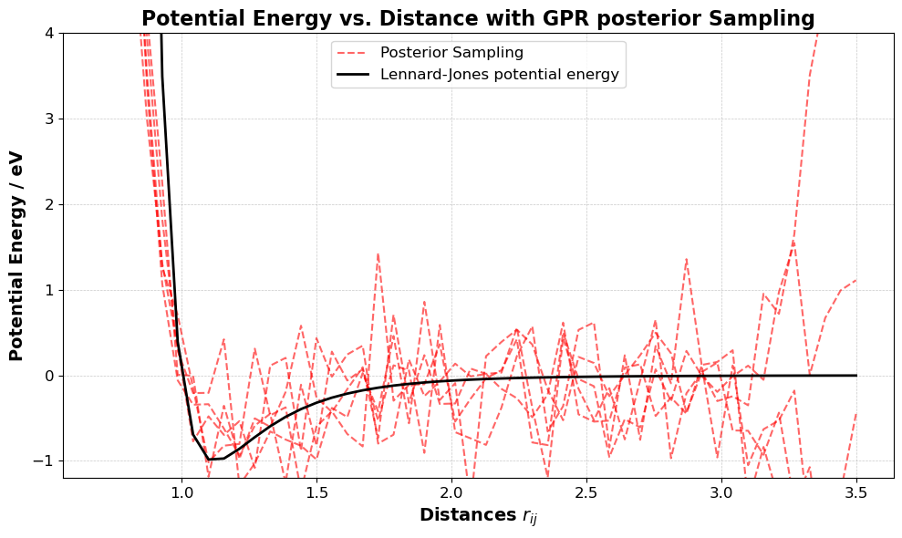
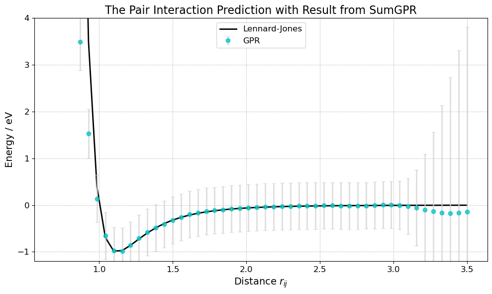
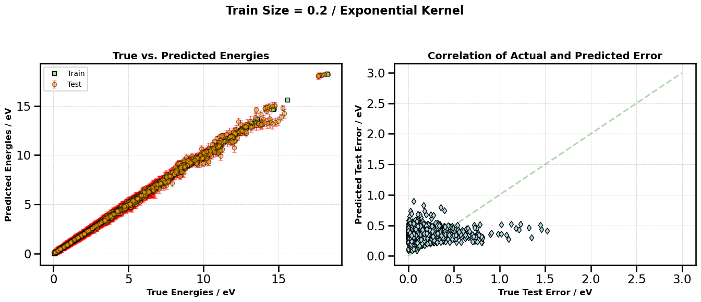

# Gaussian Process regression for fitting interatomic potentials

Two notebooks:

[**Inferring a pair interaction model based on total energy information of a nobel gas cluster using multiple GPR models**](https://github.com/Melikakmm/Gaussian_Regression_Process_interactive_potential/blob/main/Cluster_GPR.ipynb)

